# AI推理服务系统详细设计文档

## 1. 引言

### 1.1 文档目的

本文档详细描述了AI推理服务系统Cinfer的详细设计方案，为系统的开发、测试和维护提供技术参考。文档面向系统开发者、测试人员、运维人员及项目管理者，提供系统架构、组件设计、接口规范及实现细节等内容。

### 1.2 系统概述

Cinfer (Vision AI Inference Service) 是一个轻量级、高性能的视觉AI推理服务系统，为AI模型的发布和调用提供统一的管理平台。系统支持多种深度学习框架和推理引擎，提供标准化的API接口，使开发者能够便捷地发布、管理和使用AI模型。

### 1.3 适用范围

本系统主要适用于中小型发布场景，支持边缘设备和本地服务器环境，重点关注以下应用场景：

- AI模型开发者将自训练模型发布到推理服务中
- 应用开发者通过API调用已发布的AI模型进行推理
- 系统管理员对模型和推理服务进行统一管理和监控

### 1.4 术语定义

- **Cinfer**: Vision AI Inference Service的简称，本系统的名称
- **模型(Model)**: 经过训练的AI模型，如目标检测、分类等模型
- **推理引擎(Inference Engine)**: 用于执行AI模型推理的软件组件，如ONNX Runtime、TensorRT等
- **推理(Inference)**: 使用训练好的模型对输入数据进行预测的过程
- **Token**: 用于API认证和授权的密钥

### 1.5 需求分析

根据业务需求，Cinfer系统需要满足以下核心需求：

#### 1.5.1 功能需求

1. **推理引擎底座**
   - 支持TensorRT、ONNX、PyTorch等多种推理引擎
   - 抽象统一的引擎接口，便于扩展新的推理引擎
   - 支持模型格式验证与自动测试
2. **模型管理**
   - 模型上传、验证、配置、测试、发布和下架
   - 模型版本管理
   - 模型元数据管理（名称、备注、输入输出参数等）
   - 模型状态监控
3. **API服务**
   - 内部管理API：基于RESTful风格，供管理员使用
     - 登录认证
     - 系统信息查询
     - 模型管理（CRUD操作）
     - Token管理
   - 外部OpenAPI：基于RESTful风格，供外部应用调用
     - 模型列表查询
     - 模型详情查询
     - 模型推理（单张和批量）
     - 基于Token的认证
4. **用户界面**
   - 初始化页面：首次安装时设置管理员账号
   - 登录页面：管理员登录系统
   - Dashboard：展示系统基本信息和运行状态
   - 模型管理页面：模型的添加、编辑、发布、下架和删除
   - Token管理页面：Token的创建、编辑和删除

#### 1.5.2 非功能需求

1. **性能需求**
   - 50次推理调用能在10秒内完成并返回结果
   - 支持并发请求处理
   - 资源使用效率优化

2. **安全需求**
   - 基于Token的API访问控制
   - 细粒度的权限管理
   - IP白名单限制
   - 请求频率和数量限制

3. **可扩展性需求**
   - 支持扩展新的推理引擎
   - 支持扩展存储方案
   - 支持不同的部署模式

4. **可用性需求**
   - 系统状态监控
   - 错误处理和恢复机制
   - 日志记录

## 2. 系统概述

### 2.1 总体架构

系统采用分层模块化架构设计，主要包括以下几层：

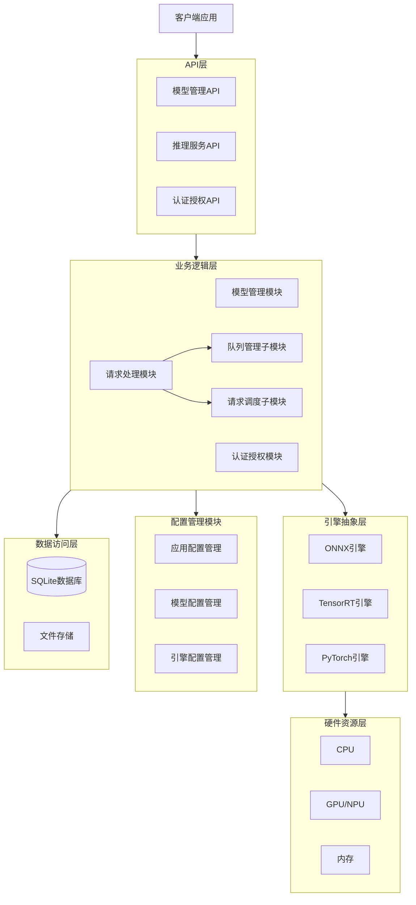
```mermaid
flowchart TD
    Client[客户端应用] --> API[API层]
    
    subgraph API["API层"]
        ModelAPI[模型管理API] 
        InferAPI[推理服务API]
        AuthAPI[认证授权API]
    end
    
    API --> Business[业务逻辑层]
    
    subgraph Business["业务逻辑层"]
        ModelModule[模型管理模块]
        RequestModule[请求处理模块]
        AuthModule[认证授权模块]
        
        RequestModule --> QueueManager[队列管理子模块]
        RequestModule --> Scheduler[请求调度子模块]
    end
    
    Business --> EngineLayer[引擎抽象层]
    Business --> ConfigModule[配置管理模块]
    Business --> DataAccess[数据访问层]
    
    subgraph EngineLayer["引擎抽象层"]
        ONNXEngine[ONNX引擎]
        TRTEngine[TensorRT引擎]
        PyTorchEngine[PyTorch引擎]
    end
    
    subgraph ConfigModule["配置管理模块"]
        AppConfig[应用配置管理]
        ModelConfig[模型配置管理]
        EngineConfig[引擎配置管理]
    end
    
    subgraph DataAccess["数据访问层"]
        SQLite[(SQLite数据库)]
        FileStorage[文件存储]
    end
    
    EngineLayer --> Hardware[硬件资源层]
    
    subgraph Hardware["硬件资源层"]
        CPU[CPU]
        GPU[GPU/NPU]
        Memory[内存]
    end
```

### 2.2 核心功能

Cinfer系统提供以下核心功能：

1. **模型管理**：
   - 模型上传、验证和发布
   - 模型生命周期管理
2. **推理服务**：
   - 同步推理请求处理
   - 多引擎支持(ONNX Runtime，Open Vino，PaddlePaddle， Pytorch， TensorRT)
   - 批量推理优化(后续迭代实现)
3. **认证与授权**：
   - 基于Token的API访问控制
   - 细粒度权限管理
   - 请求限流与使用统计
4. **系统监控**：
   - 性能指标收集(后续迭代实现)
   - 日志记录与分析(后续迭代实现)
   - 资源使用率监控(后续迭代实现)

### 2.3 技术选型

| 组件       | 技术选择     | 说明                               |
| ---------- | ------------ | ---------------------------------- |
| 开发语言   | Python 3.10+ | 广泛的AI框架支持，良好的跨平台性   |
| Web框架    | FastAPI      | 高性能异步API框架，自动生成API文档 |
| ASGI服务器 | Uvicorn      | 高性能ASGI服务器，支持HTTPS        |
| 数据库     | SQLite       | 轻量级文件数据库，适合中小型发布   |
| 推理引擎   | ONNX Runtime | 跨平台高性能推理引擎，广泛兼容性   |
| 推理引擎   | Open Vino    | 优化加速英特尔硬件上的推理引擎     |
| 推理引擎   | PaddlePaddle | 百度开发的开源深度学习平台         |
| 认证方案   | JWT Token    | 轻量级无状态认证方案               |
| 前端框架   | React        | 专注于高效地构建组件化的用户界面   |
| 发布方式   | Docker       | 容器化发布，简化环境配置           |

### 2.4 系统特点

1. **轻量级设计**：适合边缘设备和中小型服务器发布，资源占用小
2. **高扩展性**：插件化设计支持多种推理引擎和存储方案
3. **标准化接口**：统一的REST API接口便于系统集成
4. **平台无关性**：支持多种硬件平台和操作系统
5. **安全可靠**：完善的认证和授权机制保障系统安全

## 3. 设计约束与原则

### 3.1 设计约束

在设计Cinfer系统时，需要考虑以下约束条件：

#### 3.1.1 硬件约束

1. **适配中小型发布环境**：系统设计以4核心CPU、8GB内存的标准配置为基准
2. **最小化GPU依赖**：核心功能应能在CPU环境下运行，GPU加速为可选功能
3. **存储容量限制**：设计时考虑本地存储容量有限（典型为50-100GB）
4. **网络带宽限制**：针对边缘设备的有限带宽设计高效通信协议

#### 3.1.2 软件约束

1. **兼容性要求**：支持主流Linux发行版和Windows 10/11
2. **依赖项控制**：减少第三方依赖，便于发布和维护
3. **并发处理能力**：支持中等规模并发（每秒5-10个请求）
4. **性能目标**：50次调用能够在10秒内完成推理并给出完整结果

#### 3.1.3 安全约束

1. **最小权限原则**：系统各组件仅获取必要的访问权限
2. **数据隔离**：用户数据和模型数据严格隔离
3. **通信安全**：支持HTTPS和Token认证保障API安全
4. **模型保护**：防止未授权访问和下载模型

### 3.2 设计原则

Cinfer系统设计遵循以下核心原则：

#### 3.2.1 架构原则

1. **分层架构**：清晰的层次结构便于维护和扩展
2. **模块化设计**：高内聚低耦合的模块组织
3. **接口隔离**：通过定义明确的接口隔离不同功能
4. **关注点分离**：各组件专注于自身核心职责

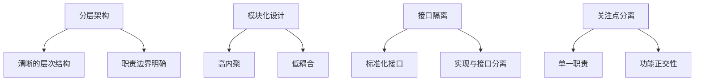
```mermaid
graph TD
    A[分层架构] --> B[清晰的层次结构]
    A --> C[职责边界明确]
    
    D[模块化设计] --> E[高内聚]
    D --> F[低耦合]
    
    G[接口隔离] --> H[标准化接口]
    G --> I[实现与接口分离]
    
    J[关注点分离] --> K[单一职责]
    J --> L[功能正交性]
```

#### 3.2.2 扩展性原则

1. **插件化机制**：通过抽象接口支持不同实现的插入
2. **配置驱动**：关键参数通过配置文件控制，减少硬编码
3. **热插拔支持**：运行时动态加载/卸载组件
4. **平台抽象**：隔离平台特定实现，便于跨平台发布

#### 3.2.3 性能原则

1. **资源池化**：重用计算资源和连接资源
2. **懒加载策略**：按需加载资源，减少启动开销
3. **缓存优化**：合理利用内存缓存提高响应速度
4. **并发处理**：利用多线程/异步处理提高吞吐量

#### 3.2.4 可靠性原则

1. **优雅降级**：部分功能不可用时保持核心服务稳定
2. **故障隔离**：单个组件失败不影响整体系统
3. **状态监控**：实时监控系统健康状态
4. **日志完善**：详细记录系统活动，便于问题诊断

## 4.模块设计

### 4.1. 引擎抽象模块

引擎抽象模块是Cinfer的核心基础设施，负责统一抽象各类推理引擎，为上层提供一致的接口，实现对TensorRT、ONNX Runtime和PyTorch等多种推理引擎的无缝支持。

#### 4.1.1 模块架构

引擎系统采用轻量化分层架构，核心组成如下：

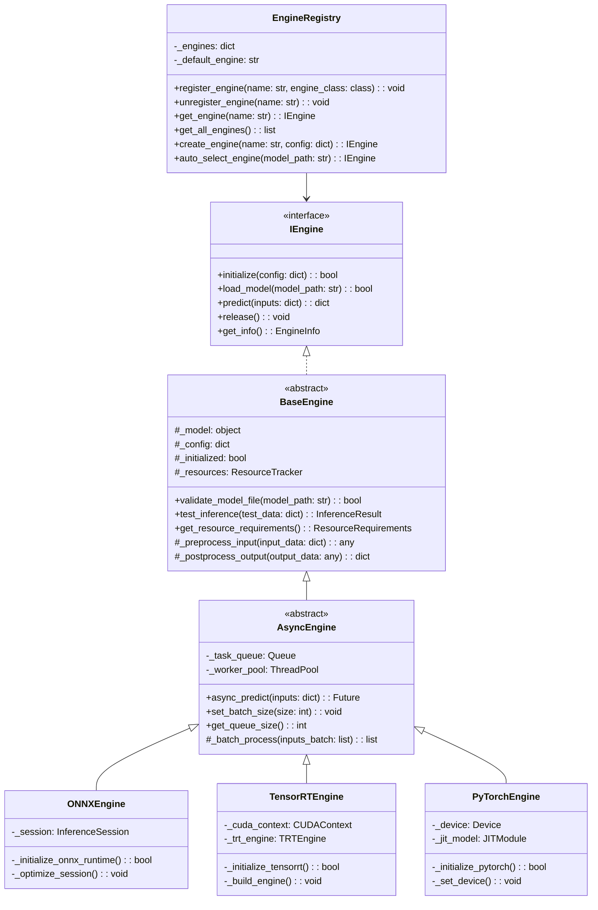
```mermaid
classDiagram
    class IEngine {
        <<interface>>
        +initialize(config: dict): bool
        +load_model(model_path: str): bool
        +predict(inputs: dict): dict
        +release(): void
        +get_info(): EngineInfo
    }
    
    class BaseEngine {
        <<abstract>>
        #_model: object
        #_config: dict
        #_initialized: bool
        #_resources: ResourceTracker
        +validate_model_file(model_path: str): bool
        +test_inference(test_data: dict): InferenceResult
        +get_resource_requirements(): ResourceRequirements
        #_preprocess_input(input_data: dict): any
        #_postprocess_output(output_data: any): dict
    }
    
    class AsyncEngine {
        <<abstract>>
        -_task_queue: Queue
        -_worker_pool: ThreadPool
        +async_predict(inputs: dict): Future
        +set_batch_size(size: int): void
        +get_queue_size(): int
        #_batch_process(inputs_batch: list): list
    }
    
    class ONNXEngine {
        -_session: InferenceSession
        -_initialize_onnx_runtime(): bool
        -_optimize_session(): void
    }
    
    class TensorRTEngine {
        -_cuda_context: CUDAContext
        -_trt_engine: TRTEngine
        -_initialize_tensorrt(): bool
        -_build_engine(): void
    }
    
    class PyTorchEngine {
        -_device: Device
        -_jit_model: JITModule
        -_initialize_pytorch(): bool
        -_set_device(): void
    }
    
    class EngineRegistry {
        -_engines: dict
        -_default_engine: str
        +register_engine(name: str, engine_class: class): void
        +unregister_engine(name: str): void
        +get_engine(name: str): IEngine
        +get_all_engines(): list
        +create_engine(name: str, config: dict): IEngine
        +auto_select_engine(model_path: str): IEngine
    }
    
    IEngine <|.. BaseEngine
    BaseEngine <|-- AsyncEngine
    AsyncEngine <|-- ONNXEngine
    AsyncEngine <|-- TensorRTEngine
    AsyncEngine <|-- PyTorchEngine
    EngineRegistry --> IEngine
```

#### 4.1.2 核心组件

1. **IEngine接口**
   - 定义统一的推理引擎标准接口
   - 简化上层应用与底层引擎的交互
   - 主要方法包括初始化、加载模型、执行推理和释放资源

2. **BaseEngine抽象类**
   - 实现IEngine接口的基础功能
   - 提供共享的工具方法如模型文件验证
   - 管理引擎的基本生命周期和资源
   - 实现通用的输入预处理和输出后处理框架

3. **AsyncEngine抽象类**
   - 扩展BaseEngine，增加异步处理能力
   - 管理任务队列和工作线程池
   - 支持批处理操作以提高吞吐量
   - 提供非阻塞的预测接口

4. **具体引擎实现**
   - **ONNXEngine**：封装ONNX Runtime，优先推荐使用，提供跨平台支持
   - **TensorRTEngine**：针对NVIDIA GPU环境提供高性能推理
   - **PyTorchEngine**：支持PyTorch模型，提供更大的灵活性
   - ...

5. **EngineRegistry**
   - 实现工厂模式，管理引擎注册和创建
   - 支持运行时动态注册和卸载引擎
   - 提供自动选择最适合引擎的能力
   - 维护引擎配置和元数据

#### 4.1.3 特性与优化

1. **轻量级设计**
   - 核心功能专注于模型加载和推理，减少不必要的复杂性
   - 针对中小规模发布场景进行优化
   - 低内存占用，适合边缘设备发布

2. **资源管理**
   - 引擎实例跟踪自身资源使用（内存、计算设备）
   - 提供自动降级机制（如从GPU降至CPU）
   - 模型预热减少首次推理延迟

3. **优化机制**
   - 批处理支持提高吞吐量
   - 动态线程管理降低资源竞争
   - 模型优化选项配置

#### 4.1.4 与其他模块交互

1. **与模型管理模块**
   - 提供模型文件验证接口
   - 提供模型加载和推理能力
   - 支持模型热更新机制

2. **与请求处理模块**
   - 提供同步和异步推理接口
   - 支持批处理和队列管理
   - 提供性能和资源使用信息

3. **与配置管理模块**
   - 接收引擎特定配置参数
   - 支持动态配置更新
   - 提供默认配置模板

### 4.2. 模型管理模块

模型管理模块负责AI模型的全生命周期管理，实现模型文件的上传、验证、配置、发布和热更新等功能。

#### 4.2.1 模块架构

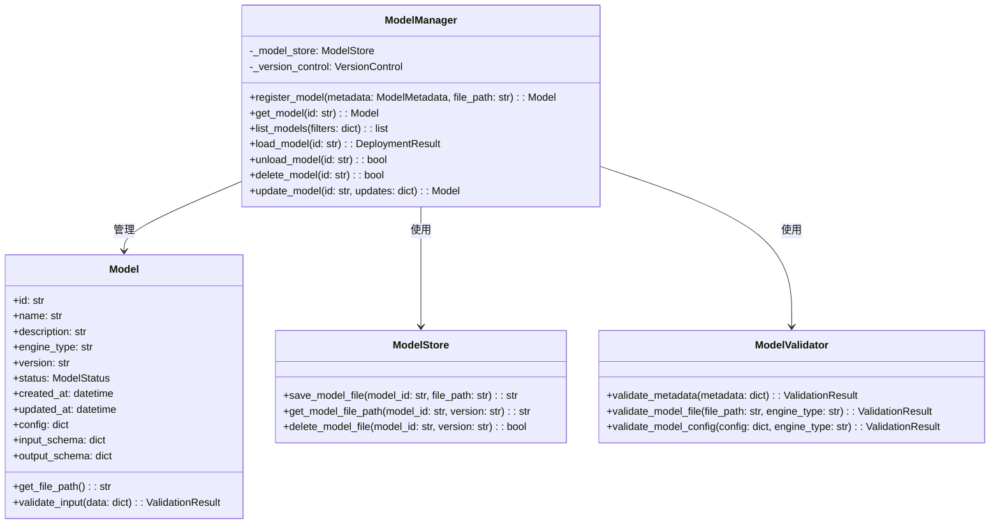
```mermaid
classDiagram
    class ModelManager {
        -_model_store: ModelStore
        -_version_control: VersionControl
        +register_model(metadata: ModelMetadata, file_path: str): Model
        +get_model(id: str): Model
        +list_models(filters: dict): list
        +load_model(id: str): DeploymentResult
        +unload_model(id: str): bool
        +delete_model(id: str): bool
        +update_model(id: str, updates: dict): Model
    }
    
    class Model {
        +id: str
        +name: str
        +description: str
        +engine_type: str
        +version: str
        +status: ModelStatus
        +created_at: datetime
        +updated_at: datetime
        +config: dict
        +input_schema: dict
        +output_schema: dict
        +get_file_path(): str
        +validate_input(data: dict): ValidationResult
    }
    
    
    class ModelStore {
        +save_model_file(model_id: str, file_path: str): str
        +get_model_file_path(model_id: str, version: str): str
        +delete_model_file(model_id: str, version: str): bool
    }
    
    class ModelValidator {
        +validate_metadata(metadata: dict): ValidationResult
        +validate_model_file(file_path: str, engine_type: str): ValidationResult
        +validate_model_config(config: dict, engine_type: str): ValidationResult
    }
    
    ModelManager --> Model: 管理
    ModelManager --> ModelStore: 使用
    ModelManager --> ModelValidator: 使用
```

#### 4.2.2 核心组件

1. **ModelManager**
   - 模型管理模块的中央协调器，提供统一的操作接口
   - 处理模型的注册、发布、更新和删除
   - 面向上层API提供模型管理功能
2. **Model**
   - 表示单个模型的实体类
   - 包含模型的基本信息和元数据
   - 跟踪模型的状态和版本信息
   - 提供输入验证和访问方法
3. **ModelStore**
   - 管理模型文件的物理存储
   - 支持文件的保存、读取和删除
   - 针对本地文件系统优化
4. **ModelValidator**
   - 验证模型文件、元数据和配置
   - 确保模型符合系统要求
   - 提供测试推理验证功能

#### 4.2.3 模型上传流程

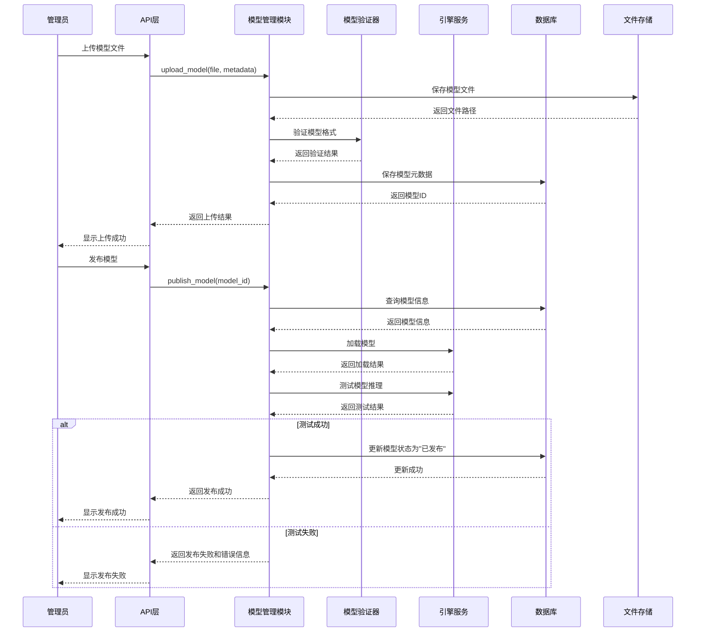
```mermaid
sequenceDiagram
    participant Admin as 管理员
    participant API as API层
    participant ModelMgr as 模型管理模块
    participant Validator as 模型验证器
    participant Engine as 引擎服务
    participant DB as 数据库
    participant Storage as 文件存储
    
    Admin->>API: 上传模型文件
    API->>ModelMgr: upload_model(file, metadata)
    ModelMgr->>Storage: 保存模型文件
    Storage-->>ModelMgr: 返回文件路径
    ModelMgr->>Validator: 验证模型格式
    Validator-->>ModelMgr: 返回验证结果
    ModelMgr->>DB: 保存模型元数据
    DB-->>ModelMgr: 返回模型ID
    ModelMgr-->>API: 返回上传结果
    API-->>Admin: 显示上传成功
    
    Admin->>API: 发布模型
    API->>ModelMgr: publish_model(model_id)
    ModelMgr->>DB: 查询模型信息
    DB-->>ModelMgr: 返回模型信息
    ModelMgr->>Engine: 加载模型
    Engine-->>ModelMgr: 返回加载结果
    ModelMgr->>Engine: 测试模型推理
    Engine-->>ModelMgr: 返回测试结果
    
    alt 测试成功
        ModelMgr->>DB: 更新模型状态为"已发布"
        DB-->>ModelMgr: 更新成功
        ModelMgr-->>API: 返回发布成功
        API-->>Admin: 显示发布成功
    else 测试失败
        ModelMgr-->>API: 返回发布失败和错误信息
        API-->>Admin: 显示发布失败
    end
```


### 4.3. 请求处理模块

请求处理模块负责接收并处理推理请求，实现高效的请求队列管理和调度，确保系统能够满足"50次推理在10秒内完成"的性能需求。

#### 4.3.1 模块架构

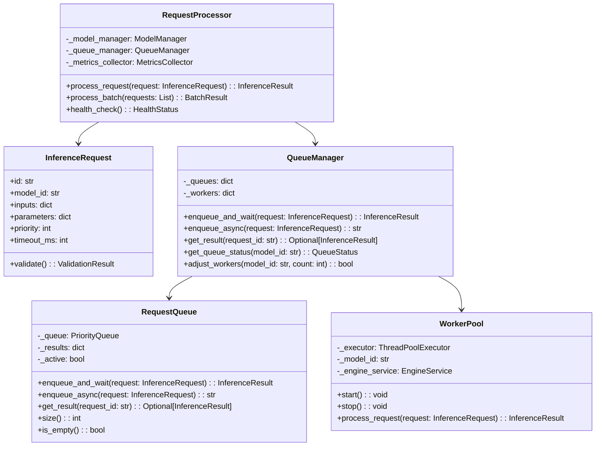
```mermaid
classDiagram
    class RequestProcessor {
        -_model_manager: ModelManager
        -_queue_manager: QueueManager
        -_metrics_collector: MetricsCollector
        +process_request(request: InferenceRequest): InferenceResult
        +process_batch(requests: List): BatchResult
        +health_check(): HealthStatus
    }
    
    class InferenceRequest {
        +id: str
        +model_id: str
        +inputs: dict
        +parameters: dict
        +priority: int
        +timeout_ms: int
        +validate(): ValidationResult
    }
    
    class QueueManager {
        -_queues: dict
        -_workers: dict
        +enqueue_and_wait(request: InferenceRequest): InferenceResult
        +enqueue_async(request: InferenceRequest): str
        +get_result(request_id: str): Optional[InferenceResult]
        +get_queue_status(model_id: str): QueueStatus
        +adjust_workers(model_id: str, count: int): bool
    }
    
    class RequestQueue {
        -_queue: PriorityQueue
        -_results: dict
        -_active: bool
        +enqueue_and_wait(request: InferenceRequest): InferenceResult
        +enqueue_async(request: InferenceRequest): str
        +get_result(request_id: str): Optional[InferenceResult]
        +size(): int
        +is_empty(): bool
    }
    
    class WorkerPool {
        -_executor: ThreadPoolExecutor
        -_model_id: str
        -_engine_service: EngineService
        +start(): void
        +stop(): void
        +process_request(request: InferenceRequest): InferenceResult
    }
    
    RequestProcessor --> InferenceRequest
    RequestProcessor --> QueueManager
    QueueManager --> RequestQueue
    QueueManager --> WorkerPool
```

#### 4.3.2 核心组件

1. **RequestProcessor**
   - 请求处理模块的主入口点
   - 接收来自API层的推理请求
   - 负责请求预处理和基本验证
   - 协调队列管理和结果收集

2. **InferenceRequest**
   - 封装单个推理请求的所有信息
   - 包含模型ID、输入数据和参数
   - 支持请求优先级和超时控制
   - 提供输入验证功能

3. **QueueManager**
   - 管理模型专用请求队列
   - 实现请求的入队和等待处理
   - 监控队列状态和统计信息
   - 动态调整工作线程数量

4. **RequestQueue**
   - 实现优先级队列，确保高优先级请求先处理
   - 支持请求超时机制
   - 维护队列统计信息
   - 优化的轻量级实现，适合中小规模发布

5. **WorkerPool**
   - 为每个模型维护专用的工作线程池
   - 从队列获取请求并执行处理
   - 管理线程资源和并发度
   - 实现动态线程数调整

#### 4.3.3 请求处理流程

针对性能需求优化的处理流程：

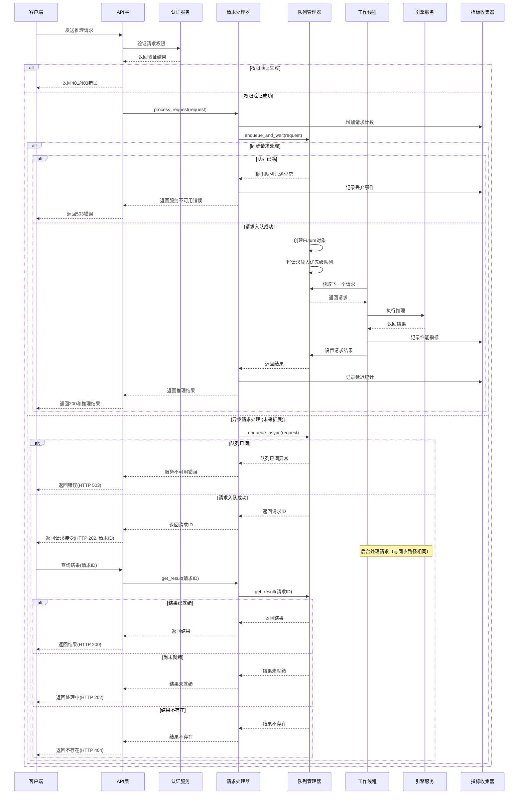
```mermaid
sequenceDiagram
    participant Client as 客户端
    participant API as API层
    participant Auth as 认证服务
    participant Processor as 请求处理器
    participant Queue as 队列管理器
    participant Worker as 工作线程
    participant Engine as 引擎服务
    participant Metrics as 指标收集器
    
    Client->>API: 发送推理请求
    API->>Auth: 验证请求权限
    Auth-->>API: 返回验证结果
    
    alt 权限验证失败
        API-->>Client: 返回401/403错误
    else 权限验证成功
    API->>Processor: process_request(request)
        Processor->>Metrics: 增加请求计数
    Processor->>Queue: enqueue_and_wait(request)
    
        alt 同步请求处理
            alt 队列已满
                Queue-->>Processor: 抛出队列已满异常
                Processor->>Metrics: 记录丢弃事件
                Processor-->>API: 返回服务不可用错误
                API-->>Client: 返回503错误
            else 请求入队成功
                Queue->>Queue: 创建Future对象
    Queue->>Queue: 将请求放入优先级队列
    
    Worker->>Queue: 获取下一个请求
    Queue-->>Worker: 返回请求
    Worker->>Engine: 执行推理
    Engine-->>Worker: 返回结果
                Worker->>Metrics: 记录性能指标
    Worker->>Queue: 设置请求结果
                Queue-->>Processor: 返回结果
                Processor->>Metrics: 记录延迟统计
                Processor-->>API: 返回推理结果
                API-->>Client: 返回200和推理结果
            end
        else 异步请求处理 (未来扩展)
            Processor->>Queue: enqueue_async(request)
            alt 队列已满
                Queue-->>Processor: 队列已满异常
                Processor-->>API: 服务不可用错误
                API-->>Client: 返回错误(HTTP 503)
            else 请求入队成功
                Queue-->>Processor: 返回请求ID
                Processor-->>API: 返回请求ID
                API-->>Client: 返回请求接受(HTTP 202, 请求ID)
                
                Note over Worker,Engine: 后台处理请求（与同步路径相同）
                
                Client->>API: 查询结果(请求ID)
                API->>Processor: get_result(请求ID)
                Processor->>Queue: get_result(请求ID)
                
                alt 结果已就绪
    Queue-->>Processor: 返回结果
    Processor-->>API: 返回结果
    API-->>Client: 返回结果(HTTP 200)
                else 尚未就绪
                    Queue-->>Processor: 结果未就绪
                    Processor-->>API: 结果未就绪
                    API-->>Client: 返回处理中(HTTP 202)
                else 结果不存在
                    Queue-->>Processor: 结果不存在
                    Processor-->>API: 结果不存在
                    API-->>Client: 返回不存在(HTTP 404)
                end
            end
        end
    end
```

#### 4.3.4 性能优化策略

1. **队列优化**
   - 基于优先级的请求调度
   - 请求批处理支持，提高吞吐量
   - 请求超时机制，防止长时间阻塞

2. **并发控制**
   - 每个模型独立的工作线程池
   - 基于负载的动态线程数调整
   - 资源隔离防止单个模型影响系统

3. **资源管理**
   - 内存池复用减少分配开销
   - 懒加载和卸载机制
   - 周期性资源回收

4. **响应优化**
   - 结果缓存减少重复计算
   - 异步IO减少等待时间
   - 预处理和后处理并行化

### 4.4. 认证授权模块

认证授权模块实现基于Token的API访问控制，支持IP白名单和请求频率限制，确保系统安全。

#### 4.4.1 模块架构

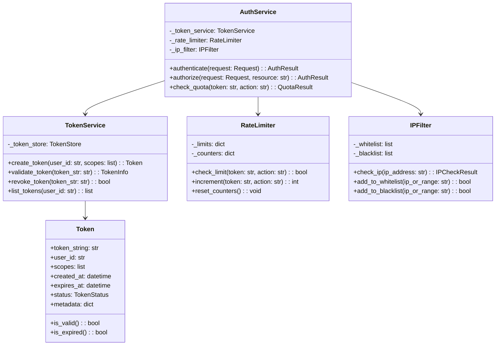
```mermaid
classDiagram
    class AuthService {
        -_token_service: TokenService
        -_rate_limiter: RateLimiter
        -_ip_filter: IPFilter
        +authenticate(request: Request): AuthResult
        +authorize(request: Request, resource: str): AuthResult
        +check_quota(token: str, action: str): QuotaResult
    }
    
    class TokenService {
        -_token_store: TokenStore
        +create_token(user_id: str, scopes: list): Token
        +validate_token(token_str: str): TokenInfo
        +revoke_token(token_str: str): bool
        +list_tokens(user_id: str): list
    }
    
    class RateLimiter {
        -_limits: dict
        -_counters: dict
        +check_limit(token: str, action: str): bool
        +increment(token: str, action: str): int
        +reset_counters(): void
    }
    
    class IPFilter {
        -_whitelist: list
        -_blacklist: list
        +check_ip(ip_address: str): IPCheckResult
        +add_to_whitelist(ip_or_range: str): bool
        +add_to_blacklist(ip_or_range: str): bool
    }
    
    class Token {
        +token_string: str
        +user_id: str
        +scopes: list
        +created_at: datetime
        +expires_at: datetime
        +status: TokenStatus
        +metadata: dict
        +is_valid(): bool
        +is_expired(): bool
    }
    
    AuthService --> TokenService
    AuthService --> RateLimiter
    AuthService --> IPFilter
    TokenService --> Token
```

#### 4.4.2 核心组件

1. **AuthService**
   - 认证授权模块的中央协调器
   - 验证请求权限和合法性
   - 协调令牌验证、IP检查和频率限制
   - 提供统一的认证授权接口

2. **TokenService**
   - 管理API访问令牌的生命周期
   - 创建、验证和撤销令牌
   - 管理令牌元数据和权限
   - 提供令牌查询和过滤功能

3. **RateLimiter**
   - 实现请求频率限制
   - 跟踪令牌的API调用次数
   - 支持每分钟和每月的使用限制
   - 优化的内存效率实现

4. **IPFilter**
   - 实现IP地址过滤
   - 支持IP白名单和黑名单
   - 处理IP范围和CIDR格式
   - 保护API免受未授权访问

5. **Token**
   - 表示API访问令牌的实体类
   - 包含权限范围和有效期信息
   - 支持令牌状态管理
   - 提供令牌验证方法

#### 4.4.3 认证流程

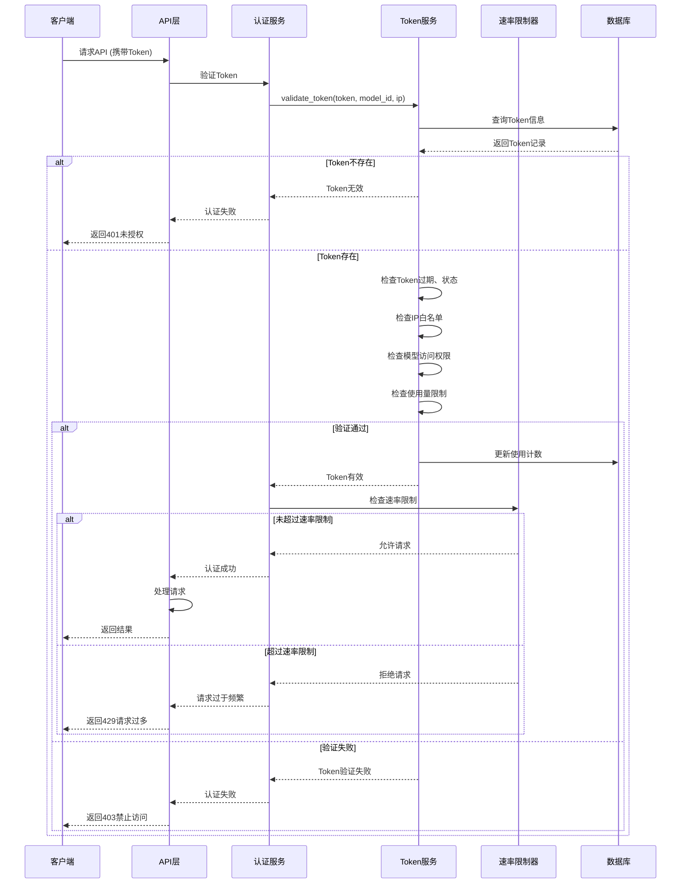
```mermaid
sequenceDiagram
    participant Client as 客户端
    participant API as API层
    participant Auth as 认证服务
    participant TokenSvc as Token服务
    participant RateLimiter as 速率限制器
    participant DB as 数据库
    
    Client->>API: 请求API (携带Token)
    API->>Auth: 验证Token
    Auth->>TokenSvc: validate_token(token, model_id, ip)
    
    TokenSvc->>DB: 查询Token信息
    DB-->>TokenSvc: 返回Token记录
    
    alt Token不存在
        TokenSvc-->>Auth: Token无效
        Auth-->>API: 认证失败
        API-->>Client: 返回401未授权
    else Token存在
        TokenSvc->>TokenSvc: 检查Token过期、状态
        TokenSvc->>TokenSvc: 检查IP白名单
        TokenSvc->>TokenSvc: 检查模型访问权限
        TokenSvc->>TokenSvc: 检查使用量限制
        
        alt 验证通过
            TokenSvc->>DB: 更新使用计数
            TokenSvc-->>Auth: Token有效
            
            Auth->>RateLimiter: 检查速率限制
            
            alt 未超过速率限制
                RateLimiter-->>Auth: 允许请求
                Auth-->>API: 认证成功
                API->>API: 处理请求
                API-->>Client: 返回结果
            else 超过速率限制
                RateLimiter-->>Auth: 拒绝请求
                Auth-->>API: 请求过于频繁
                API-->>Client: 返回429请求过多
            end
            
        else 验证失败
            TokenSvc-->>Auth: Token验证失败
            Auth-->>API: 认证失败
            API-->>Client: 返回403禁止访问
        end
    end
```

#### 4.4.4 Token结构设计

针对中小型发布场景的简化Token设计：

```json
{
  "token": "eyJhbGciOiJIUzI1NiIsInR5cCI6IkpXVCJ9...",
  "name": "移动应用集成",
  "created_at": "2023-04-01T10:00:00Z",
  "expires_at": "2023-05-01T10:00:00Z",
  "is_active": true,
  "allowed_models": ["model_123", "model_456"],
  "ip_whitelist": ["192.168.1.100", "10.0.0.1"],
  "rate_limit": 60,
  "monthly_limit": 10000,
  "used_count": 1250
}
```

### 4.5. 配置管理模块

配置管理模块负责系统配置的加载、验证和访问，为其他模块提供统一的配置接口，支持动态更新配置。

#### 4.5.1 模块架构

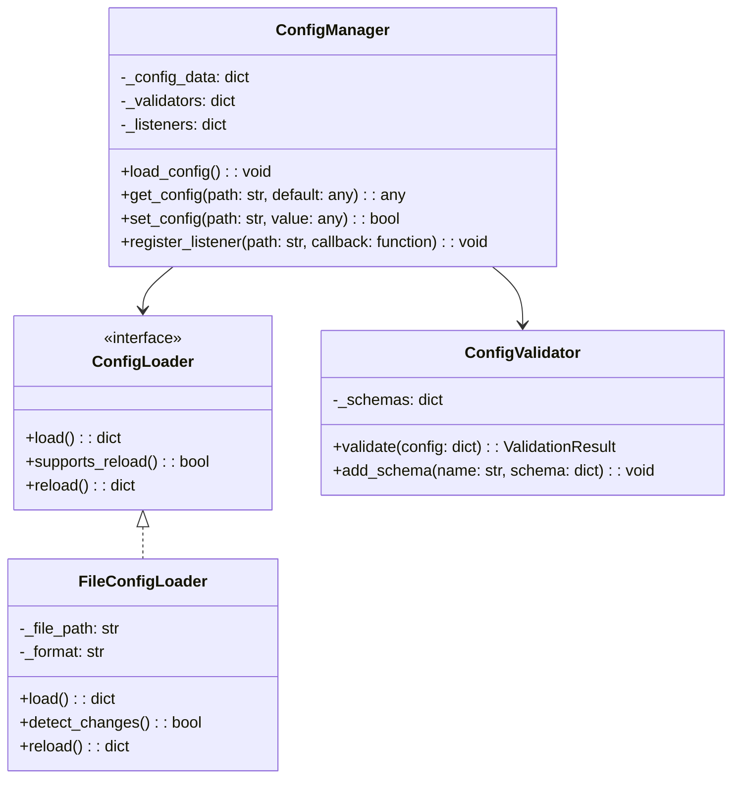
```mermaid
classDiagram
    class ConfigManager {
        -_config_data: dict
        -_validators: dict
        -_listeners: dict
        +load_config(): void
        +get_config(path: str, default: any): any
        +set_config(path: str, value: any): bool
        +register_listener(path: str, callback: function): void
    }
    
    class ConfigLoader {
        <<interface>>
        +load(): dict
        +supports_reload(): bool
        +reload(): dict
    }
    
    class FileConfigLoader {
        -_file_path: str
        -_format: str
        +load(): dict
        +detect_changes(): bool
        +reload(): dict
    }
    
    class ConfigValidator {
        -_schemas: dict
        +validate(config: dict): ValidationResult
        +add_schema(name: str, schema: dict): void
    }
    
    ConfigManager --> ConfigLoader
    ConfigManager --> ConfigValidator
    ConfigLoader <|.. FileConfigLoader
```

#### 4.5.2 核心组件

1. **ConfigManager**
   - 配置管理模块的中央协调器
   - 提供统一的配置访问接口
   - 管理配置变更通知
   - 协调配置加载和验证

2. **ConfigLoader**
   - 定义配置加载接口
   - 支持从文件和环境变量加载配置
   - 实现配置热重载功能
   - 适合中小型发布场景的简化实现

3. **FileConfigLoader**
   - 从配置文件加载配置(YAML/JSON)
   - 检测文件变更
   - 支持配置重载
   - 处理文件读写错误

4. **ConfigValidator**
   - 验证配置的有效性
   - 基于JSON Schema的配置验证
   - 提供详细的验证错误信息
   - 简化的配置约束检查

#### 4.5.3 配置层次结构

针对中小型发布场景的轻量级配置结构：

```yaml
# 服务配置
server:
  host: "0.0.0.0"
  port: 8000
  workers: 4
  log_level: "info"

# 引擎配置
engines:
  default: "onnx"
  onnx:
    enabled: true
    execution_providers: ["CPUExecutionProvider"]
    threads: 4
  tensorrt:
    enabled: false
    precision: "fp16"
  pytorch:
    enabled: true
    device: "cpu"

# 模型配置
models:
  storage_path: "data/models"
  max_file_size_mb: 100


# 请求处理
request:
  queue_size: 100
  workers_per_model: 2
  timeout_ms: 5000

# 认证配置
auth:
  token_expiry_days: 30
  rate_limit:
    requests_per_minute: 60
    requests_per_month: 10000
  ip_filter:
    enabled: true
```

#### 4.5.4 配置动态更新

支持配置的热更新机制：

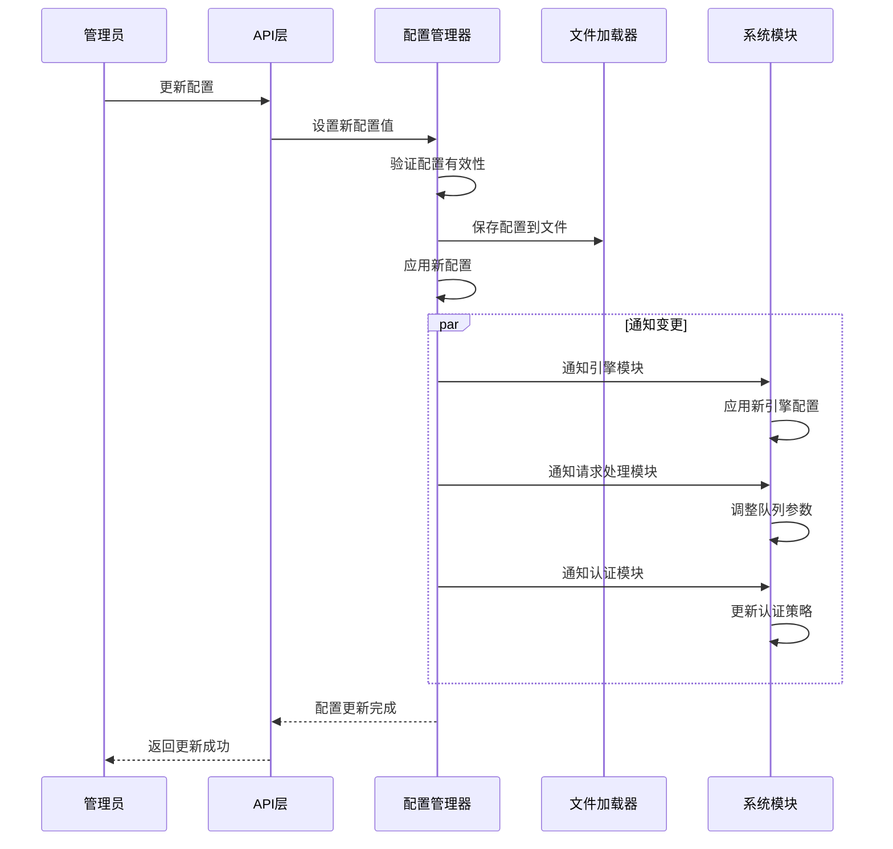
```mermaid
sequenceDiagram
    participant Admin as 管理员
    participant API as API层
    participant ConfigMgr as 配置管理器
    participant FileLoader as 文件加载器
    participant Modules as 系统模块
    
    Admin->>API: 更新配置
    API->>ConfigMgr: 设置新配置值
    ConfigMgr->>ConfigMgr: 验证配置有效性
    ConfigMgr->>FileLoader: 保存配置到文件
    
    ConfigMgr->>ConfigMgr: 应用新配置
    
    par 通知变更
        ConfigMgr->>Modules: 通知引擎模块
        Modules->>Modules: 应用新引擎配置
        
        ConfigMgr->>Modules: 通知请求处理模块
        Modules->>Modules: 调整队列参数
        
        ConfigMgr->>Modules: 通知认证模块
        Modules->>Modules: 更新认证策略
    end
    
    ConfigMgr-->>API: 配置更新完成
    API-->>Admin: 返回更新成功
```

### 4.6. 模块间交互

系统各模块通过清晰定义的接口交互，协同工作实现推理服务功能。

#### 4.6.1 主要交互流程

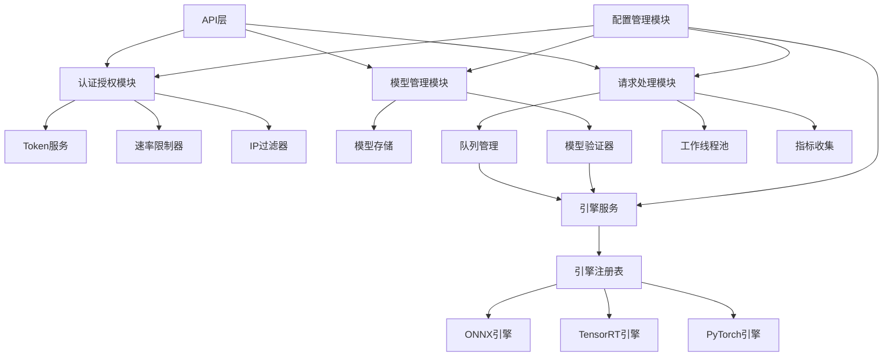
```mermaid
graph TD
    API[API层] --> Auth[认证授权模块]
    API --> ModelMgr[模型管理模块]
    API --> ReqProc[请求处理模块]
    
    Auth --> TokenSvc[Token服务]
    Auth --> RateLimit[速率限制器]
    Auth --> IPFilter[IP过滤器]
    
    ModelMgr --> ModelStore[模型存储]
    ModelMgr --> Validator[模型验证器]
    
    ReqProc --> QueueMgr[队列管理]
    ReqProc --> Workers[工作线程池]
    ReqProc --> Metrics[指标收集]
    
    QueueMgr --> EngSvc[引擎服务]
    Validator --> EngSvc
    
    EngSvc --> EngReg[引擎注册表]
    EngReg --> ONNXEng[ONNX引擎]
    EngReg --> TRTEng[TensorRT引擎]
    EngReg --> PTEng[PyTorch引擎]
    
    ConfigMgr[配置管理模块] --> ModelMgr
    ConfigMgr --> ReqProc
    ConfigMgr --> Auth
    ConfigMgr --> EngSvc
```

#### 4.6.2 关键交互场景

1. **模型上传和发布流程**
   - API层接收模型上传请求
   - 认证模块验证操作权限
   - 模型管理模块验证和存储模型
   - 引擎服务加载模型并测试
   - 模型管理模块更新模型状态为"已发布"
2. **推理请求处理流程**
   - API层接收推理请求
   - 认证模块验证Token和权限
   - 请求处理模块对请求进行队列管理
   - 工作线程调用引擎服务执行推理
   - 请求处理模块返回结果给API层

#### 4.6.3 系统整体类图

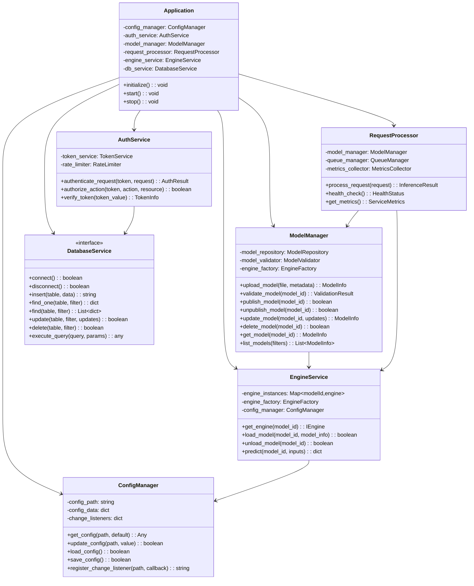
```mermaid
classDiagram
    class Application {
        -config_manager: ConfigManager
        -auth_service: AuthService
        -model_manager: ModelManager
        -request_processor: RequestProcessor
        -engine_service: EngineService
        -db_service: DatabaseService
        +initialize(): void
        +start(): void
        +stop(): void
    }
    
    class ModelManager {
        -model_repository: ModelRepository
        -model_validator: ModelValidator
        -engine_factory: EngineFactory
        +upload_model(file, metadata): ModelInfo
        +validate_model(model_id): ValidationResult
        +publish_model(model_id): boolean
        +unpublish_model(model_id): boolean
        +update_model(model_id, updates): ModelInfo
        +delete_model(model_id): boolean
        +get_model(model_id): ModelInfo
        +list_models(filters): List~ModelInfo~
    }
    
    class RequestProcessor {
        -model_manager: ModelManager
        -queue_manager: QueueManager
        -metrics_collector: MetricsCollector
        +process_request(request): InferenceResult
        +health_check(): HealthStatus
        +get_metrics(): ServiceMetrics
    }
    
    class EngineService {
        -engine_instances: Map~modelId,engine~
        -engine_factory: EngineFactory
        -config_manager: ConfigManager
        +get_engine(model_id): IEngine
        +load_model(model_id, model_info): boolean
        +unload_model(model_id): boolean
        +predict(model_id, inputs): dict
    }
    
    class AuthService {
        -token_service: TokenService
        -rate_limiter: RateLimiter
        +authenticate_request(token, request): AuthResult
        +authorize_action(token, action, resource): boolean
        +verify_token(token_value): TokenInfo
    }
    
    class DatabaseService {
        <<interface>>
        +connect(): boolean
        +disconnect(): boolean
        +insert(table, data): string
        +find_one(table, filter): dict
        +find(table, filter): List~dict~
        +update(table, filter, updates): boolean
        +delete(table, filter): boolean
        +execute_query(query, params): any
    }

    class ConfigManager {
        -config_path: string
        -config_data: dict
        -change_listeners: dict
        +get_config(path, default): Any
        +update_config(path, value): boolean
        +load_config(): boolean
        +save_config(): boolean
        +register_change_listener(path, callback): string
    }
    
    Application --> ModelManager
    Application --> RequestProcessor
    Application --> EngineService
    Application --> AuthService
    Application --> DatabaseService
    Application --> ConfigManager
    ModelManager --> EngineService
    RequestProcessor --> ModelManager
    RequestProcessor --> EngineService
    EngineService --> ConfigManager
    AuthService --> DatabaseService
```

#### 4.6.4 模块依赖关系

系统模块的依赖关系遵循单向依赖原则，形成层次化架构：

1. **依赖方向**
   - API层依赖业务模块（模型管理、请求处理、认证授权）
   - 业务模块依赖基础设施（引擎服务、配置管理）
   - 基础设施模块相互独立，仅依赖通用工具类

2. **接口隔离**
   - 模块之间通过接口进行交互，隐藏实现细节
   - 依赖注入实现松耦合设计
   - 避免循环依赖，保持清晰的层次结构

3. **通信机制**
   - 直接方法调用：同步操作
   - 事件通知：配置变更、状态更新
   - 消息队列：请求处理和任务调度

## 5. 数据库设计

### 5.1 数据库选型

Cinfer系统采用SQLite作为主要数据库，原因如下：

1. **轻量级**：SQLite是一个文件型数据库，不需要独立的数据库服务器
2. **易于发布**：作为单文件数据库，SQLite简化了发布和维护
3. **性能适中**：对于中小型发布场景，SQLite提供了足够的性能
4. **无需额外依赖**：减少系统发布的复杂性
5. **跨平台支持**：SQLite支持所有主流操作系统

同时，系统设计保留了向PostgreSQL等关系型数据库迁移的能力，以支持未来可能的大规模发布需求。

### 5.2 实体关系图

下图展示了Cinfer系统的主要实体及其关系：

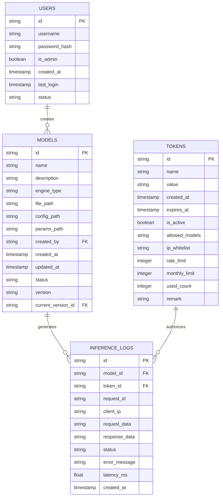
```mermaid
erDiagram
    USERS ||--o{ MODELS : creates
    MODELS ||--o{ INFERENCE_LOGS : generates
    TOKENS ||--o{ INFERENCE_LOGS : authorizes
    
    USERS {
        string id PK
        string username
        string password_hash
        boolean is_admin
        timestamp created_at
        timestamp last_login
        string status
    }
    
    MODELS {
        string id PK
        string name
        string description
        string engine_type
        string file_path
        string config_path
        string params_path
        string created_by FK
        timestamp created_at
        timestamp updated_at
        string status
        string version
        string current_version_id FK
    }
    

    
    TOKENS {
        string id PK
        string name
        string value
        timestamp created_at
        timestamp expires_at
        boolean is_active
        string allowed_models
        string ip_whitelist
        integer rate_limit
        integer monthly_limit
        integer used_count
        string remark
    }
    
    INFERENCE_LOGS {
        string id PK
        string model_id FK
        string token_id FK
        string request_id
        string client_ip
        string request_data
        string response_data
        string status
        string error_message
        float latency_ms
        timestamp created_at
    }
```

### 5.3 表结构设计

#### 5.3.1 用户表 (users)

用户表存储系统用户信息，包括管理员和普通用户。

```sql
CREATE TABLE users (
    id TEXT PRIMARY KEY,
    username TEXT UNIQUE NOT NULL,
    password_hash TEXT NOT NULL,
    is_admin BOOLEAN NOT NULL DEFAULT FALSE,
    created_at TIMESTAMP NOT NULL DEFAULT CURRENT_TIMESTAMP,
    last_login TIMESTAMP,
    status TEXT DEFAULT 'active'
);
```

#### 5.3.2 模型表 (models)

模型表存储AI模型的基本信息和当前状态。

```sql
CREATE TABLE models (
    id TEXT PRIMARY KEY,
    name TEXT NOT NULL,
    description TEXT,
    engine_type TEXT NOT NULL,  -- 'onnx', 'tensorrt', 'pytorch'
    file_path TEXT NOT NULL,
    config_path TEXT NOT NULL,
    params_path TEXT,
    created_by TEXT,
    created_at TIMESTAMP NOT NULL DEFAULT CURRENT_TIMESTAMP,
    updated_at TIMESTAMP NOT NULL DEFAULT CURRENT_TIMESTAMP,
    status TEXT DEFAULT 'draft',  -- 'draft', 'published', 'deprecated'
    version TEXT DEFAULT '1.0',
    current_version_id TEXT,
    FOREIGN KEY (created_by) REFERENCES users (id)
);
```


#### 5.3.3 Token表 (tokens)

Token表存储API访问密钥信息，用于认证和授权。

```sql
CREATE TABLE tokens (
    id TEXT PRIMARY KEY,
    name TEXT NOT NULL,
    value TEXT UNIQUE NOT NULL,
    created_at TIMESTAMP NOT NULL DEFAULT CURRENT_TIMESTAMP,
    expires_at TIMESTAMP,
    is_active BOOLEAN NOT NULL DEFAULT TRUE,
    allowed_models TEXT,  -- JSON数组
    ip_whitelist TEXT,    -- JSON数组
    rate_limit INTEGER DEFAULT 100,
    monthly_limit INTEGER DEFAULT 10000,
    used_count INTEGER DEFAULT 0,
    remark TEXT
);
```

#### 5.3.4 推理日志表 (inference_logs)

推理日志表记录所有推理请求的详情和结果，用于监控和分析。

```sql
CREATE TABLE inference_logs (
    id TEXT PRIMARY KEY,
    model_id TEXT NOT NULL,
    token_id TEXT,
    request_id TEXT,
    client_ip TEXT,
    request_data TEXT,  -- JSON
    response_data TEXT, -- JSON
    status TEXT,
    error_message TEXT,
    latency_ms REAL,
    created_at TIMESTAMP NOT NULL DEFAULT CURRENT_TIMESTAMP,
    FOREIGN KEY (model_id) REFERENCES models (id),
    FOREIGN KEY (token_id) REFERENCES tokens (id)
);
```

### 5.4 索引设计

为提高查询性能，设计了以下索引：

```sql
-- 模型状态索引，用于快速查询已发布模型
CREATE INDEX idx_models_status ON models(status);

-- 模型引擎类型索引，用于按引擎类型筛选模型
CREATE INDEX idx_models_engine_type ON models(engine_type);

-- 模型创建时间索引，用于按时间排序
CREATE INDEX idx_models_created_at ON models(created_at);

-- Token值索引，用于Token验证
CREATE INDEX idx_tokens_value ON tokens(value);

-- Token有效期索引，用于清理过期Token
CREATE INDEX idx_tokens_expires_at ON tokens(expires_at);

-- 推理日志模型ID索引，用于按模型查询日志
CREATE INDEX idx_inference_logs_model_id ON inference_logs(model_id);

-- 推理日志时间索引，用于时间范围查询
CREATE INDEX idx_inference_logs_created_at ON inference_logs(created_at);

-- 推理日志状态索引，用于筛选错误日志
CREATE INDEX idx_inference_logs_status ON inference_logs(status);
```

### 5.5 查询模式

系统常见的数据库查询模式包括：

#### 5.5.1 模型查询

```sql
-- 获取所有已发布的模型
SELECT * FROM models WHERE status = 'published';

-- 获取特定类型的模型
SELECT * FROM models WHERE engine_type = 'onnx' AND status = 'published';

-- 获取模型的最新版本
SELECT m.*, mv.*
FROM models m
JOIN model_versions mv ON m.current_version_id = mv.id
WHERE m.id = ?;

-- 获取模型版本历史
SELECT * FROM model_versions WHERE model_id = ? ORDER BY created_at DESC;
```

#### 5.5.2 Token查询

```sql
-- 验证Token
SELECT * FROM tokens 
WHERE value = ? AND is_active = TRUE AND expires_at > CURRENT_TIMESTAMP;

-- 获取Token使用统计
SELECT SUM(used_count) as total_usage FROM tokens WHERE id = ?;

-- 获取即将过期的Token
SELECT * FROM tokens 
WHERE expires_at BETWEEN CURRENT_TIMESTAMP AND datetime('now', '+7 days')
AND is_active = TRUE;
```

#### 5.5.3 日志查询

```sql
-- 获取模型推理日志
SELECT * FROM inference_logs 
WHERE model_id = ? 
ORDER BY created_at DESC 
LIMIT 100;

-- 获取错误日志
SELECT * FROM inference_logs 
WHERE status = 'error' 
ORDER BY created_at DESC;

-- 获取性能统计
SELECT model_id, AVG(latency_ms) as avg_latency, COUNT(*) as count
FROM inference_logs
WHERE created_at > datetime('now', '-1 day')
GROUP BY model_id;

-- 获取特定时间段的使用量
SELECT DATE(created_at) as date, COUNT(*) as request_count
FROM inference_logs
WHERE created_at BETWEEN ? AND ?
GROUP BY DATE(created_at)
ORDER BY date;
```

### 5.6 数据迁移与扩展

系统设计支持从SQLite迁移到更强大的关系型数据库系统（如PostgreSQL）的能力，为未来可能的大规模发布做准备：

```python
class DatabaseFactory:
    """数据库工厂，根据配置创建不同的数据库实例"""
    
    @staticmethod
    def create_database(config: dict):
        """创建数据库实例
        
        Args:
            config: 数据库配置
            
        Returns:
            数据库服务实例
        """
        db_type = config.get("type", "sqlite").lower()
        
        if db_type == "sqlite":
            return SQLiteDatabase(config)
        elif db_type == "postgresql":
            return PostgreSQLDatabase(config)
        else:
            raise ValueError(f"不支持的数据库类型: {db_type}")
```

数据库迁移工具将提供以下功能：

1. **模式迁移**：转换表结构和索引
2. **数据迁移**：复制现有数据
3. **增量同步**：在迁移期间保持数据一致
4. **回滚支持**：在迁移失败时恢复原始状态


## 6. 状态机设计

### 6.1 模型生命周期状态机

模型在系统中从创建到删除的整个生命周期可以用以下状态机表示：

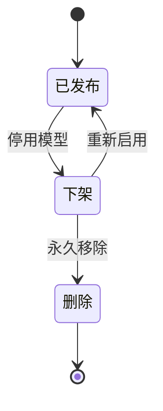
```mermaid
stateDiagram-v2
    [*] --> 已发布
    已发布 --> 下架: 停用模型
    下架 --> 已发布: 重新启用
    下架 --> 删除: 永久移除
    删除 --> [*]
```

#### 6.1.1 状态说明

| 状态   | 描述                               | 允许的操作               | 转换条件                   |
| ------ | ---------------------------------- | ------------------------ | -------------------------- |
| 已发布 | 模型已验证、配置并可用于推理请求   | 下架、查看性能、查看日志 | 调用下架接口将模型停用     |
| 下架   | 模型已暂停服务但保留所有配置和数据 | 重新发布、删除、编辑配置 | 调用发布接口重新启用模型   |
| 删除   | 模型及其所有资源被永久移除         | 无                       | 删除操作完成后自动转出系统 |

#### 6.1.2 状态转换事件

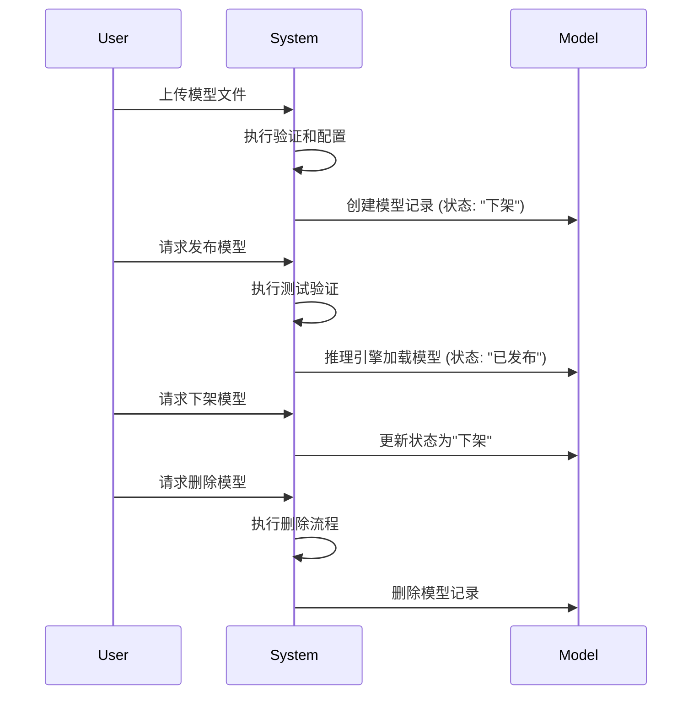
```mermaid
sequenceDiagram
    participant User
    participant System
    participant Model
    
    User->>System: 上传模型文件
    System->>System: 执行验证和配置
    System->>Model: 创建模型记录 (状态: "下架")
    
    User->>System: 请求发布模型
    System->>System: 执行测试验证
    System->>Model: 推理引擎加载模型 (状态: "已发布")
    
    User->>System: 请求下架模型
    System->>Model: 更新状态为"下架"
    
  
    User->>System: 请求删除模型
    System->>System: 执行删除流程
    System->>Model: 删除模型记录
    
```

### 6.2 推理请求状态机

推理请求在系统中从接收到完成的过程可以用以下状态机表示：

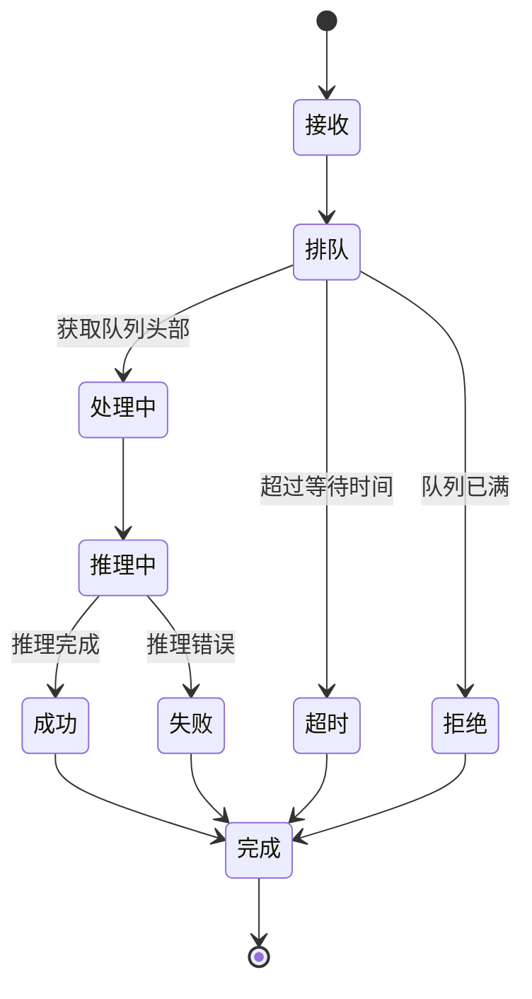
```mermaid
stateDiagram-v2
    [*] --> 接收
    接收 --> 排队
    排队 --> 处理中: 获取队列头部
    排队 --> 超时: 超过等待时间
    排队 --> 拒绝: 队列已满
    处理中 --> 推理中
    推理中 --> 成功: 推理完成
    推理中 --> 失败: 推理错误
    成功 --> 完成
    失败 --> 完成
    超时 --> 完成
    拒绝 --> 完成
    完成 --> [*]
```

#### 6.2.1 状态说明

| 状态   | 描述                         | 允许的操作   | 转换条件                 |
| ------ | ---------------------------- | ------------ | ------------------------ |
| 接收   | 推理请求已接收               | 验证、拒绝   | 验证通过后转换到排队状态 |
| 排队   | 请求在队列中等待处理         | 等待、取消   | 到达队列头部或超时       |
| 处理中 | 请求已分配给工作线程准备处理 | 等待         | 预处理完成后转换         |
| 推理中 | 模型正在执行推理计算         | 等待         | 推理完成后自动转换       |
| 成功   | 推理已成功完成               | 返回结果     | 结果处理完成后转换       |
| 失败   | 推理过程中发生错误           | 返回错误     | 错误处理完成后转换       |
| 超时   | 请求在队列中等待超时         | 返回超时错误 | 超时处理完成后转换       |
| 拒绝   | 请求被系统拒绝               | 返回拒绝原因 | 拒绝处理完成后转换       |
| 完成   | 请求处理完成，结果已返回     | 日志记录     | 请求结束                 |

### 6.3 引擎实例状态机

推理引擎实例的生命周期可以用以下状态机表示：

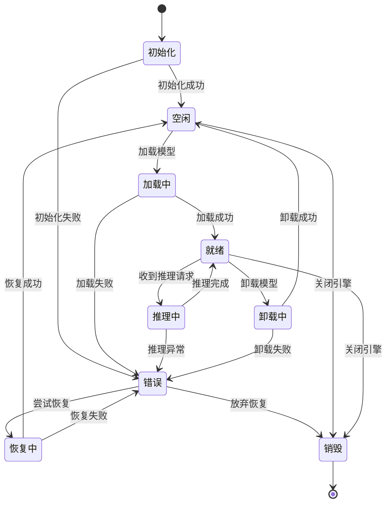
```mermaid
stateDiagram-v2
    [*] --> 初始化
    初始化 --> 空闲: 初始化成功
    初始化 --> 错误: 初始化失败
    空闲 --> 加载中: 加载模型
    加载中 --> 就绪: 加载成功
    加载中 --> 错误: 加载失败
    就绪 --> 推理中: 收到推理请求
    推理中 --> 就绪: 推理完成
    推理中 --> 错误: 推理异常
    就绪 --> 卸载中: 卸载模型
    卸载中 --> 空闲: 卸载成功
    卸载中 --> 错误: 卸载失败
    错误 --> 恢复中: 尝试恢复
    恢复中 --> 空闲: 恢复成功
    恢复中 --> 错误: 恢复失败
    错误 --> 销毁: 放弃恢复
    空闲 --> 销毁: 关闭引擎
    就绪 --> 销毁: 关闭引擎
    销毁 --> [*]
```

#### 6.3.1 状态说明

| 状态   | 描述                           | 允许的操作               | 转换条件                 |
| ------ | ------------------------------ | ------------------------ | ------------------------ |
| 初始化 | 引擎实例正在创建中             | 等待                     | 初始化完成后自动转换     |
| 空闲   | 引擎实例已创建但未加载模型     | 加载模型、销毁           | 调用加载模型接口触发转换 |
| 加载中 | 引擎实例正在加载模型           | 等待                     | 加载完成后自动转换       |
| 就绪   | 模型已加载完成，可以执行推理   | 执行推理、卸载模型、销毁 | 根据操作触发转换         |
| 推理中 | 引擎实例正在执行推理计算       | 等待                     | 推理完成后自动转换       |
| 卸载中 | 引擎实例正在卸载模型           | 等待                     | 卸载完成后自动转换       |
| 错误   | 引擎实例处于错误状态           | 尝试恢复、销毁           | 根据操作触发转换         |
| 恢复中 | 引擎实例正在尝试从错误状态恢复 | 等待                     | 恢复完成后自动转换       |
| 销毁   | 引擎实例正在销毁中             | 等待                     | 销毁完成后自动转换       |

### 6.4 API Token状态机

API Token的生命周期可以用以下状态机表示：

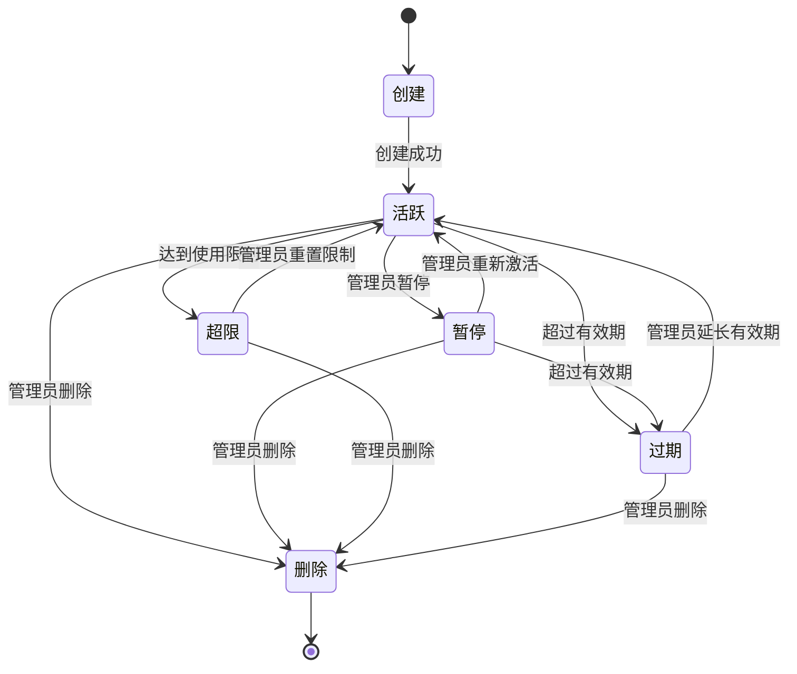
```mermaid
stateDiagram-v2
    [*] --> 创建
    创建 --> 活跃: 创建成功
    活跃 --> 暂停: 管理员暂停
    暂停 --> 活跃: 管理员重新激活
    活跃 --> 超限: 达到使用限制
    超限 --> 活跃: 管理员重置限制
    活跃 --> 过期: 超过有效期
    过期 --> 活跃: 管理员延长有效期
    活跃 --> 删除: 管理员删除
    暂停 --> 删除: 管理员删除
    超限 --> 删除: 管理员删除
    过期 --> 删除: 管理员删除
    暂停 --> 过期: 超过有效期
    删除 --> [*]
```

#### 6.4.1 状态说明

| 状态 | 描述                          | 允许的操作       | 转换条件                   |
| ---- | ----------------------------- | ---------------- | -------------------------- |
| 创建 | Token正在创建中               | 等待             | 创建完成后自动转换         |
| 活跃 | Token处于活跃状态，可正常使用 | 使用、暂停、删除 | 根据操作或条件触发转换     |
| 暂停 | Token被管理员暂时禁用         | 重新激活、删除   | 管理员手动触发转换         |
| 超限 | Token已达到使用限制           | 重置限制,删除    | 管理员手动触发转换         |
| 过期 | Token已超过有效期             | 延长有效期,删除  | 管理员手动触发转换         |
| 删除 | Token被永久删除               | 无               | 删除操作完成后自动转出系统 |


## 7. 可扩展性与演进

### 7.1 系统演进路线图

Cinfer系统计划按照以下路线图进行演进(仅供参考)：

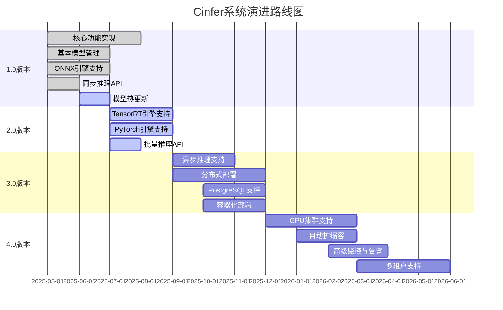
```mermaid
gantt
    title Cinfer系统演进路线图
    dateFormat  YYYY-MM
    
    section 1.0版本
    核心功能实现            :done, 2025-05, 3M
    基本模型管理            :done, 2025-05, 2M
    ONNX引擎支持            :done, 2025-05, 2M
    同步推理API             :done, 2025-05, 1M
    模型热更新              :active, 2025-06, 1M
    
    section 2.0版本
    TensorRT引擎支持        :active, 2025-07, 2M
    PyTorch引擎支持         :active, 2025-07, 2M
    批量推理API             :active, 2025-07, 1M

    
    section 3.0版本
    异步推理支持            :2025-09, 2M
    分布式部署              :2025-09, 3M
    PostgreSQL支持          :2025-10, 2M
    容器化部署              :2025-10, 2M
    
    section 4.0版本
    GPU集群支持             :2025-12, 3M
    自动扩缩容              :2026-01, 2M
    高级监控与告警          :2026-02, 2M
    多租户支持              :2026-03, 3M
```

### 7.2 引擎扩展

系统支持扩展新的推理引擎，实现`IEngine`接口即可添加对新推理框架的支持：

1. **支持的新引擎**:
   - **TFLite**: 轻量级TensorFlow模型支持
   - **OpenVINO**: Intel加速推理引擎
   - **CoreML**: Apple设备优化引擎
   - **NCNN**: 移动端高效推理引擎

2. **引擎实现示例**:

```python
class OpenVINOEngine(AsyncEngine):
    """OpenVINO推理引擎实现"""
    
    def __init__(self, config=None):
        super().__init__(config or {})
        self._device = self._config.get('device', 'CPU')
        self._metadata = {}
        self._input_names = []
        self._output_names = []
    
    def load_model(self, model_path, config):
        try:
            from openvino.inference_engine import IECore
            
            ie = IECore()
            network = ie.read_network(model=model_path)
            self._model = ie.load_network(network=network, device_name=self._device)
            
            # 获取输入输出信息
            self._input_names = list(network.input_info.keys())
            self._output_names = list(network.outputs.keys())
            
            # 存储元数据
            self._metadata = {
                'inputs': [
                    {
                        'name': name,
                        'shape': network.input_info[name].input_data.shape,
                        'type': str(network.input_info[name].input_data.precision)
                    } for name in self._input_names
                ],
                'outputs': [
                    {
                        'name': name,
                        'shape': network.outputs[name].shape,
                        'type': str(network.outputs[name].precision)
                    } for name in self._output_names
                ],
                'device': self._device
            }
            
            self._initialized = True
            return True
            
        except Exception as e:
            logging.error(f"加载OpenVINO模型失败: {str(e)}")
            return False
    
    # 其他方法实现...
```

### 7.3 数据库扩展

系统支持扩展到更多数据库系统，满足大规模发布需求：

1. **支持的数据库**:
   - **PostgreSQL**: 高性能关系型数据库
   - **MySQL/MariaDB**: 广泛使用的开源数据库
   - **MongoDB**: 文档型NoSQL数据库
   - **Redis**: 高性能键值存储，用于缓存

2. **数据库实现示例**:

```python
class PostgreSQLDatabase(DatabaseService):
    """PostgreSQL数据库实现"""
    
    def __init__(self, config):
        self._config = config
        self._pool = None
        self._connected = False
    
    def connect(self):
        try:
            import psycopg2
            from psycopg2 import pool
            
            self._pool = pool.ThreadedConnectionPool(
                minconn=self._config.get('min_connections', 1),
                maxconn=self._config.get('max_connections', 10),
                host=self._config.get('host', 'localhost'),
                port=self._config.get('port', 5432),
                database=self._config.get('database', 'cinfer'),
                user=self._config.get('user', 'cinfer'),
                password=self._config.get('password', '')
            )
            
            self._connected = True
            return True
            
            except Exception as e:
            logging.error(f"连接PostgreSQL数据库失败: {str(e)}")
            return False
    
    # 其他方法实现...
```

### 7.4 发布扩展

系统支持多种发布方式，满足不同的发布需求：

1. **发布模式**:
   - **单机发布**: 适合小型场景
   - **主从发布**: 读写分离，提高可用性
   - **集群发布**: 水平扩展，提高吞吐量
   - **边缘发布**: 发布到边缘设备

2. **容器编排**:
   - **Docker Compose**: 简单多容器发布
   - **Kubernetes**: 大规模容器编排
   - **Helm Charts**: 简化Kubernetes发布

3. **Kubernetes发布示例**:

```yaml
# kubernetes/deployment.yaml
apiVersion: apps/v1
kind: Deployment
metadata:
  name: cinfer-api
  labels:
    app: cinfer
    component: api
spec:
  replicas: 3
  selector:
    matchLabels:
      app: cinfer
      component: api
  template:
    metadata:
      labels:
        app: cinfer
        component: api
    spec:
      containers:
      - name: cinfer-api
        image: cinfer/api:latest
        ports:
        - containerPort: 8000
        resources:
          limits:
            cpu: "2"
            memory: "2Gi"
          requests:
            cpu: "0.5"
            memory: "512Mi"
        env:
        - name: CINFER_DATABASE__HOST
          value: "postgres-service"
        - name: CINFER_DATABASE__TYPE
          value: "postgresql"
        volumeMounts:
        - name: config-volume
          mountPath: /app/config
        - name: models-volume
          mountPath: /app/data/models
      volumes:
      - name: config-volume
        configMap:
          name: cinfer-config
      - name: models-volume
        persistentVolumeClaim:
          claimName: models-pvc
```

## 8. 附录

### 8.1 术语表

| 术语     | 定义                                              |
| -------- | ------------------------------------------------- |
| AI推理   | 使用训练好的AI模型进行预测的过程                  |
| API      | 应用程序接口，允许不同软件组件交互                |
| ASGI     | 异步服务器网关接口，用于异步Web服务器             |
| FastAPI  | 一个高性能的Python Web框架                        |
| JWT      | JSON Web Token，一种紧凑的、URL安全的方式表示声明 |
| ONNX     | 开放神经网络交换格式，一种开放标准                |
| REST     | 表征状态转移，一种API设计风格                     |
| TensorRT | NVIDIA深度学习优化推理引擎                        |
| Uvicorn  | 一个基于ASGI的轻量级快速Web服务器                 |

### 8.2 配置示例

**yaml配置文件示例**：

```yaml
# 服务配置
server:
  host: "0.0.0.0"
  port: 8000
  workers: 4
  log_level: "info"

# 引擎配置
engines:
  default: "onnx"
  onnx:
    enabled: true
    execution_providers: ["CPUExecutionProvider"]
    threads: 4
  tensorrt:
    enabled: false
    precision: "fp16"
  pytorch:
    enabled: true
    device: "cpu"

# 模型配置
models:
  storage_path: "data/models"
  max_file_size_mb: 100


# 请求处理
request:
  queue_size: 100
  workers_per_model: 2
  timeout_ms: 5000

# 认证配置
auth:
  token_expiry_days: 30
  rate_limit:
    requests_per_minute: 60
    requests_per_month: 10000
  ip_filter:
    enabled: true
```

### 8.3 参考代码结构

```txt
cinfer/
├── api/                           # API接口层
│   ├── __init__.py
│   ├── app.py                     # FastAPI应用
│   └── routes/                    # API路由
│       ├── __init__.py
│       ├── auth.py                # 认证相关路由
│       ├── health.py              # 健康检查
│       ├── models.py              # 模型管理路由
│       ├── inference.py           # 推理服务路由
│       └── tokens.py              # Token管理路由
├── core/                          # 核心功能目录
│   ├── __init__.py
│   ├── config/                    # 配置管理
│   │   ├── __init__.py
│   │   └── config_manager.py      # 配置管理器
│   ├── auth/                      # 认证授权
│   │   ├── __init__.py
│   │   ├── auth.py                # 认证服务
│   │   ├── models.py              # 认证数据模型
│   │   ├── dependencies.py        # FastAPI依赖
│   │   ├── token.py               # Token管理
│   │   ├── rate_limiter.py        # 请求频率限制
│   │   └── ip_filter.py           # IP过滤
│   ├── engine/                    # 引擎系统
│   │   ├── __init__.py
│   │   ├── base_engine.py         # 基础引擎接口
│   │   ├── engine_factory.py      # 引擎工厂
│   │   ├── onnx_engine.py         # ONNX Runtime实现
│   │   └── torch_engine.py        # PyTorch引擎实现
│   ├── model/                     # 模型管理
│   │   ├── __init__.py
│   │   ├── model_manager.py       # 模型管理器
│   │   ├── model_registry.py      # 模型注册表
│   │   └── validator.py           # 模型验证器
│   ├── request/                   # 请求处理
│   │   ├── __init__.py
│   │   ├── request_models.py      # 请求数据模型
│   │   ├── request_manager.py     # 请求管理器
│   │   ├── queue.py               # 请求队列
│   │   └── worker.py              # 工作线程池
│   ├── database/                  # 数据库抽象
│   │   ├── __init__.py
│   │   ├── database.py            # 数据库接口
│   │   └── models.py              # 数据库模型
│   ├── storage/                   # 存储抽象
│   │   ├── __init__.py
│   │   └── base.py                # 存储接口
│   └── logging.py                 # 日志管理
├── utils/                         # 工具函数
│   ├── __init__.py
│   ├── security.py                # 安全工具
│   ├── metrics.py                 # 性能指标
│   └── common.py                  # 通用工具
├── web/                           # Web界面
│   ├── __init__.py
│   ├── app.py                     # Web应用
│   ├── views/                     # 视图
│   │   ├── __init__.py
│   │   ├── dashboard.py           # 仪表盘
│   │   ├── models.py              # 模型管理
│   │   └── tokens.py              # Token管理
│   ├── static/                    # 静态资源
│   └── templates/                 # 页面模板
├── monitoring/                    # 监控系统
│   ├── __init__.py
│   ├── collector.py               # 指标收集
│   ├── exporter.py                # 指标导出
│   └── alerts.py                  # 告警
├── tests/                         # 测试目录
│   ├── __init__.py
│   ├── api/                       # API测试
│   ├── engine/                    # 引擎测试
│   ├── models/                    # 模型测试
│   └── request/                   # 请求测试
├── config/                        # 配置文件目录
│   ├── config.yml                 # 主配置
│   └── logging.yml                # 日志配置
├── data/                          # 数据存储目录
│   ├── models/                    # 模型文件
│   ├── logs/                      # 日志文件
│   └── db/                        # 数据库文件
├── scripts/                       # 运维脚本
│   ├── init_db.py                 # 初始化数据库
│   ├── init_user.py               # 初始化用户
│   └── backup.py                  # 备份工具
├── docs/                          # 文档目录
├── requirements.txt               # 依赖管理
├── setup.py                       # 安装脚本
├── Dockerfile                     # Docker构建
├── docker-compose.yml             # Docker部署
└── main.py                        # 应用入口
```

### 8.4 参考文献

1. ONNX Runtime文档: https://onnxruntime.ai/docs/
2. TensorRT开发者指南: https://docs.nvidia.com/deeplearning/tensorrt/developer-guide/
3. FastAPI官方文档: https://fastapi.tiangolo.com/
4. Uvicorn文档: https://www.uvicorn.org/
5. SQLite文档: https://www.sqlite.org/docs.html
6. PyTorch C++ API: https://pytorch.org/cppdocs/
7. JWT认证最佳实践: https://auth0.com/blog/best-practices-for-jwt-authentication/
8. Docker容器安全指南: https://docs.docker.com/engine/security/


